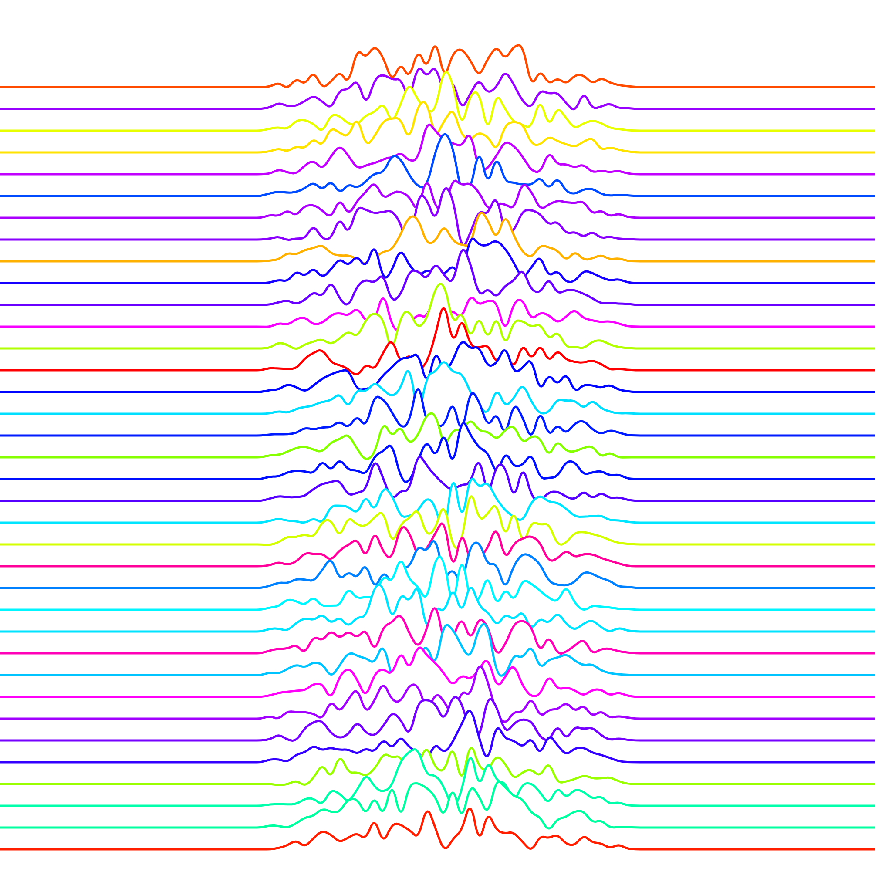
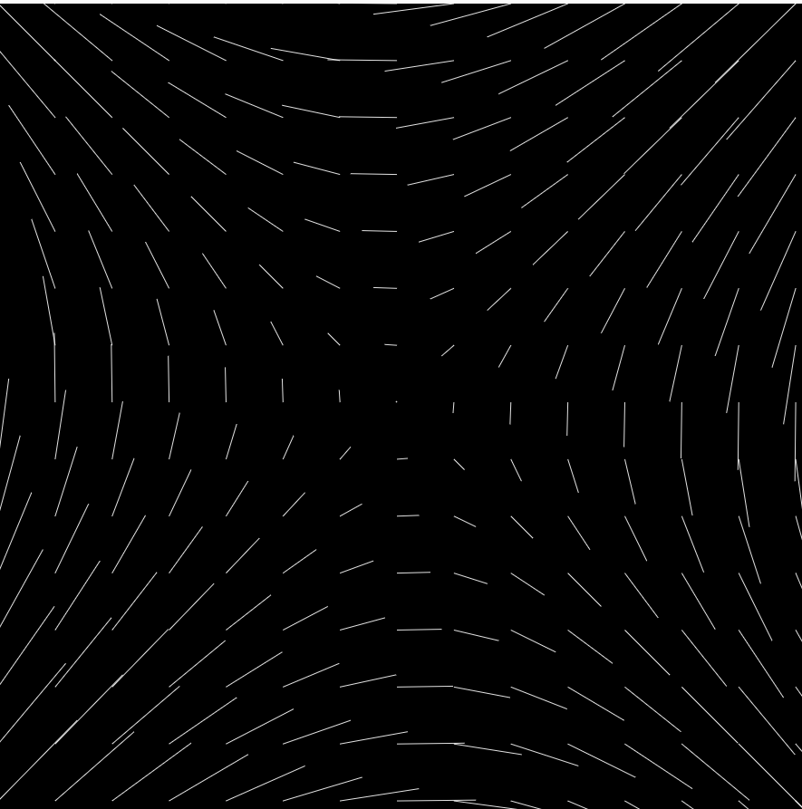

## Generative Art Experiments

These experiments utilize a helpful library called [canvas-sketch](https://github.com/mattdesl/canvas-sketch).

Develop sketch with `canvas-sketch src/foobar.js --hot --open`
Build sketch with `canvas-sketch src/foobar.js --build`

