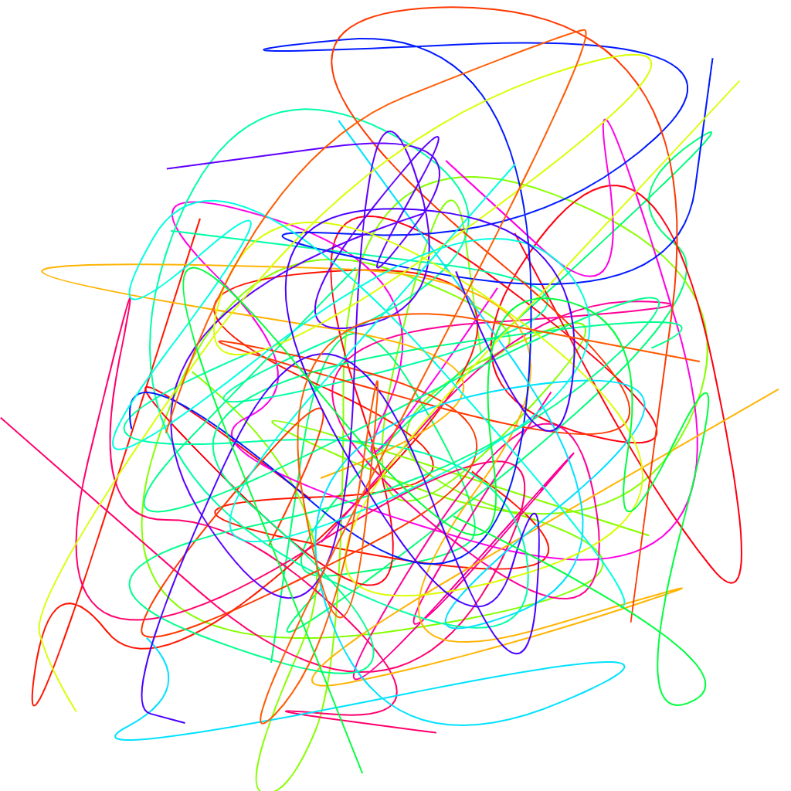

## Generative Art Experiments

These experiments utilize a helpful library called [canvas-sketch](https://github.com/mattdesl/canvas-sketch).

Create new sketch with `canvas-sketch sketch.js --new --open --hot`
 
Develop sketch with `canvas-sketch src/foobar.js --hot --open`
 
Build sketch with `canvas-sketch src/foobar.js --build`

